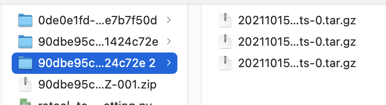
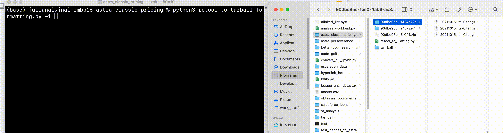

## Uploading as one whole file

Open up terminal and run the following command:
```
python3 retool_to_tarball_formatting.py -c <path to folder>
```
In the above case, you would run:
```
python3 retool_to_tarball_formatting.py -c 90dbe95c-1ee0-4ab6-ac30-60d21424c72e
```
The re-organized file will appear with the filename `tar_ball`.
## Uploading one-by-one
Open up terminal and type in:
```
python3 retool_to_tarball_formatting.py -i
```
Drag and drop in each node:

You can either drop them one by one
.gif)


Or, you can drop them in all together


Hit enter
